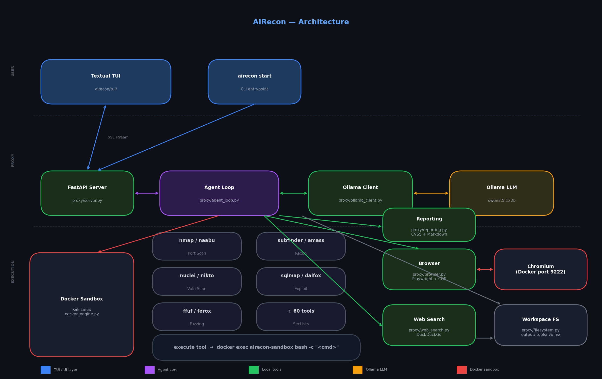

# AIRecon

**AI-Powered Security Reconnaissance Agent**

AIRecon is an autonomous cybersecurity agent that combines a self-hosted **Large Language Model (Ollama)** with a **Kali Linux Docker sandbox** and a **Textual TUI**. It is designed to automate security assessments, penetration testing, and bug bounty reconnaissance — without any API keys or cloud dependency.

## Why AIRecon?

Commercial API-based models (OpenAI GPT-4, Claude, Gemini) become prohibitively expensive for recursive, autonomous recon workflows that can require thousands of LLM calls per session.

**AIRecon is built 100% for self-hosted intelligence.**

- **No API Keys** — Eliminate monthly bills. Run everything locally.
- **Privacy First** — Your targets and findings never leave your machine.
- **Full Control** — You own the safety filters, the model, and the data.

## Architecture



| Layer | Component | Role |
|-------|-----------|------|
| UI | Textual TUI (`airecon/tui/`) | Interactive terminal interface with real-time streaming |
| Proxy | FastAPI Server (`proxy/server.py`) | SSE endpoint bridging TUI ↔ agent loop |
| Core | Agent Loop (`proxy/agent.py`) | LLM ↔ tool execution orchestrator |
| LLM | Ollama (`proxy/ollama.py`) | Streaming inference with tool calling + thinking |
| Sandbox | Docker Engine (`proxy/docker.py`) | Kali Linux container with 60+ preinstalled tools |
| Tools | Browser, Web Search, Reporting, Filesystem | Local Python tool implementations |

## Model Requirements

**Not all Ollama models will work.** AIRecon requires two hard capabilities:

1. **Extended thinking / reasoning** — The model must support `<think>` blocks (`think=true` in Ollama). Without deep reasoning, the agent loses the ability to plan multi-step attack chains, debug tool failures, and follow scope rules under complex contexts.
2. **Reliable tool-calling** — The model must consistently produce well-formed JSON tool calls. Models that hallucinate tool names or produce malformed arguments will stall the agent loop.

> ⚠️ **Minimum model size: 30B parameters.** Models below 30B frequently hallucinate tool output, invent CVEs, skip scope rules, and produce incomplete function calls — even with all anti-hallucination controls enabled. **qwen3:14b is NOT recommended for real engagements.**

**Recommended models (in order of preference):**

| Model | Pull Command | Parameters | Notes |
|-------|-------------|-----------|-------|
| **Qwen3.5 122B** | `ollama pull qwen3.5:122b` | 122B | Best quality — requires high-end hardware |
| **Qwen3 32B** | `ollama pull qwen3:32b` | 32B | **Recommended minimum** — good balance of quality and speed |
| **Qwen3 30B (A3B)** | `ollama pull qwen3:30b-a3b` | 30B MoE | MoE variant — lower VRAM, comparable reasoning to 32B |

**Minimum hardware by model:**

| Model | RAM | VRAM | Notes |
|-------|-----|------|-------|
| `qwen3:32b` | 32 GB | 20 GB | NVIDIA GPU strongly recommended |
| `qwen3:30b-a3b` | 24 GB | 16 GB | MoE — lower active params, faster inference |
| `qwen3.5:122b` | 80 GB | 48+ GB | Multi-GPU or CPU+GPU offload required |

**Known issues:**
- **DeepSeek R1** — Incomplete function calls, sticking/looping logic.
- **Models < 30B** — High hallucination rate for tool output and vulnerability findings. May work for simple specific tasks but unreliable for full recon.
- **Models < 7B** — Cannot reliably format tool calls. Not supported.
- **Generic chat models (llama3, mistral, phi)** — No reasoning support, will not follow agent scope rules.
- **Models without `think=true` support** — Set `ollama_enable_thinking: false` in config. Expect significantly lower reliability on complex tasks.

## Key Features

- **Deep Thinking Support** — Captures the model's `<think>` reasoning stream separately. The TUI displays internal thought process in real-time, distinct from tool calls and final answers.
- **Docker Sandbox Execution** — All commands run inside an isolated Kali Linux container. The `execute` tool is the single entry point for 60+ preinstalled recon tools (`nmap`, `subfinder`, `nuclei`, `sqlmap`, `ffuf`, and more).
- **Task Scope Enforcement** — The agent classifies every request as `[SPECIFIC TASK]` or `[FULL RECON]` before acting. Specific tasks stop immediately after producing the requested result — no chain creep.
- **Browser Automation** — Playwright-controlled headless Chromium (via CDP) for JavaScript-heavy targets, source inspection, and XSS verification.
- **Web Search** — DuckDuckGo-based search for CVE research, payload lookup, and WAF bypass techniques during live assessments.
- **Verified Vulnerability Reporting** — Generates professional CVSS-scored Markdown reports. Reports are only created when a working PoC is confirmed — no false positives.
- **Workspace Isolation** — Each target gets a dedicated directory tree. Scan outputs, scripts, and vulnerability reports are kept separate.
- **Skills System** — Specialized Markdown knowledge bases (`airecon/proxy/skills/`) for GraphQL, JWT, Firebase, Next.js, and more. The agent loads relevant skills based on discovered technology stacks.

## Installation

### Prerequisites

- Python 3.10+
- Docker (with the `airecon-sandbox` image built)
- Ollama running locally or on a remote endpoint

### Install

```bash
git clone https://github.com/pikpikcu/airecon.git
cd airecon
./install.sh
```

The install script builds the Docker sandbox image and installs the Python package.

## Configuration

AIRecon reads `~/.airecon/config.json`. The file is auto-generated with defaults on first run.

```json
{
    "ollama_url": "http://127.0.0.1:11434",
    "ollama_model": "qwen3:14b",
    "ollama_timeout": 1900.0,
    "ollama_num_ctx": 131072,
    "ollama_temperature": 0.1,
    "ollama_num_predict": 16384,
    "ollama_enable_thinking": true,
    "proxy_host": "127.0.0.1",
    "proxy_port": 3000,
    "command_timeout": 900.0,
    "docker_image": "airecon-sandbox",
    "docker_auto_build": true,
    "tool_response_role": "tool",
    "deep_recon_autostart": true,
    "agent_max_tool_iterations": 500,
    "agent_repeat_tool_call_limit": 2,
    "agent_missing_tool_retry_limit": 2,
    "allow_destructive_testing": true,
    "browser_page_load_delay": 1.0
}
```

**Key settings:**

| Setting | Description |
|---------|-------------|
| `ollama_temperature` | Keep at `0.1`–`0.3` for tool-calling agents. Higher values cause hallucination and scope creep. |
| `ollama_enable_thinking` | Set `true` for reasoning models (qwen3). Set `false` for standard models. |
| `ollama_num_ctx` | Context window size. 131072 = 128K tokens. Lower if you have limited VRAM. |
| `deep_recon_autostart` | If `true`, bare domain inputs (e.g. `example.com`) auto-expand to full recon. |
| `allow_destructive_testing` | Unlocks aggressive/destructive testing modes. |
| `command_timeout` | Max seconds a single shell command can run inside Docker. |

## Usage

### Start the TUI

```bash
airecon start
```

### Example Prompts

**Specific task** (agent runs one operation and stops):
```
find subdomains of example.com
scan ports on 10.0.0.1
run nuclei on output/live_hosts.txt
check for XSS on https://example.com/login
```

**Full recon** (agent follows the complete SOP):
```
full recon on example.com
pentest https://api.example.com
bug bounty recon on example.com — find everything
```

### Workspace Structure

All output is stored under `workspace/` in your current directory:

```
workspace/
└── <target>/
    ├── output/          # Raw tool outputs (.txt, .json, .xml, ...)
    ├── command/         # Command execution metadata and logs (.json)
    ├── tools/           # AI-generated Python/Bash scripts
    └── vulnerabilities/ # Verified vulnerability reports (.md)
```

## Project Structure

```
airecon/
├── airecon/
│   ├── proxy/
│   │   ├── agent.py            # Core agent: LLM ↔ tool execution loop
│   │   ├── server.py           # FastAPI + SSE server
│   │   ├── ollama.py           # Ollama SDK streaming wrapper
│   │   ├── docker.py           # Docker sandbox execution engine
│   │   ├── browser.py          # Playwright browser automation
│   │   ├── web_search.py       # DuckDuckGo web search
│   │   ├── reporting.py        # Vulnerability report generation
│   │   ├── filesystem.py       # Workspace file operations
│   │   ├── system.py           # Agent system prompt
│   │   ├── config.py           # Configuration management
│   │   └── skills/             # Markdown knowledge bases
│   └── tui/
│       ├── app.py              # Textual application
│       └── widgets/            # TUI widgets (chat, status, file preview)
├── images/
│   └── architecture.png
├── docs/
│   ├── configuration.md
│   ├── installation.md
│   ├── features.md
│   └── development/
│       ├── creating_skills.md
│       └── creating_tools.md
└── install.sh
```

## Documentation

- [Features](docs/features.md)
- [Configuration Reference](docs/configuration.md)
- [Installation Guide](docs/installation.md)
- [Adding Custom Skills](docs/development/creating_skills.md)

## License

MIT License. See `LICENSE` for details.

## Disclaimer

This tool is for **educational purposes and authorized security testing only**. Always obtain proper authorization before scanning any target. The authors are not responsible for any misuse or damage caused by this tool.


