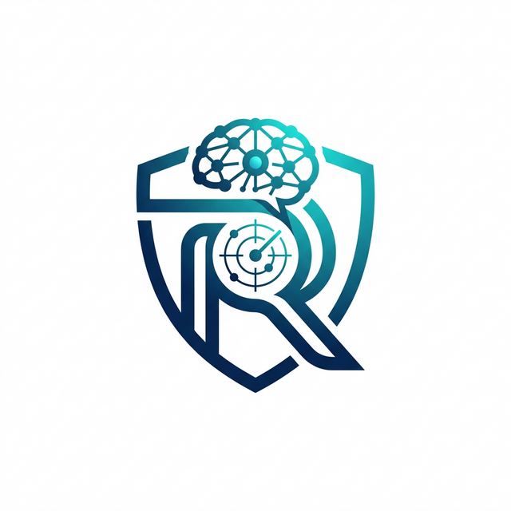

<h1 align="center">
  
</h1>
<h4 align="center">AI-Powered Autonomous Penetration Testing Agent</h4>
<p align="center">
  <a href="https://github.com/pikpikcu/airecon/releases">
  <a href="https://deepwiki.com/pikpikcu/airecon"></a>
  <a href="https://pikpikcu.github.io/airecon/"></a>
  
  
  
  <a href="https://github.com/pikpikcu/airecon/blob/master/LICENSE">
    
  </a>
</p>

AIRecon is an autonomous penetration testing agent that drives any **OpenAI-compatible LLM gateway** (LiteLLM / vLLM / a hosted endpoint — or a local gateway proxying a local Ollama) with a **Kali Linux Docker sandbox**, native **Caido proxy integration**, a structured **RECON → ANALYSIS → EXPLOIT → REPORT pipeline**, and a real-time **Textual TUI**.

> **Backend-agnostic by design.** Point AIRecon at a **local** gateway (LiteLLM / vLLM, or a gateway proxying a local Ollama) for **fully offline / private** operation, or at a **hosted** OpenAI/Anthropic/Gemini-compatible endpoint for maximum reasoning quality. Reasoning support is **auto-detected at runtime** — no per-model hardcoding.


---

## Why AIRecon?

AIRecon talks to **one OpenAI-compatible gateway**, so you choose the trade-off — run a **local** model for privacy and zero API cost, or a **hosted** model for top reasoning quality. The same agent, pipeline, sandbox, and tooling work either way.

| Feature | AIRecon |
|---------|---------|
| Backend | Any OpenAI-compatible gateway (LiteLLM / vLLM / hosted) |
| Fully offline / no API keys | **Yes** — when using a local gateway (vLLM, or a gateway → local Ollama) |
| Reasoning detection | **Automatic** at runtime (no model-name hardcoding) |
| Caido integration | **Native** |
| Scope guard + audit log | **Yes** — refuse out-of-scope targets, log every command |
| Verified-only learning | **Yes** — the brain compounds proven findings, not noise |
| Session resume (chat + tool calls) | **Yes** |
| Local knowledge base | **~1.09M records** (optional) |

- **Privacy when you want it** — with a local gateway, target intelligence, tool output, and reports never leave your machine.
- **Caido Native** — built-in tools: list, replay, automate (`§FUZZ§`), findings, scope, sitemap, intercept.
- **Full Stack** — Kali sandbox + browser automation + custom fuzzer + Schemathesis API fuzzing + Semgrep SAST.
- **Skills Knowledge Base** — 57 built-in skill files, 289 keyword → skill auto-mappings. Extended by **[airecon-skills](https://github.com/pikpikcu/airecon-skills)** — a community skill library with 57 additional CLI-based playbooks for CTF, bug bounty, and pentesting.
- **Local Security Knowledge Base** — Optional **[airecon-dataset](https://github.com/pikpikcu/airecon-dataset)** indexes ~1.09M security records (CVEs, red team techniques, CTF writeups, nuclei templates, bug bounty payloads) into local SQLite FTS5. The LLM calls `dataset_search` autonomously before attempting unfamiliar techniques — grounding its decisions in real indexed data.

---

## Pipeline

```
RECON → ANALYSIS → EXPLOIT → REPORT
```

Each phase has specific objectives, recommended tools, and automatic transition criteria. Phase enforcement is **soft** — the agent is guided but never blocked. Checkpoints run every 5 (phase eval), 10 (self-eval), and 15 (context compression) iterations.

---

## Memory & Learning (What It Actually Does)

AIRecon does **not** fine-tune the LLM. Its "learning" is local, structured telemetry that guides tool choice and avoids repeating failed paths.

**Local persistence (all on disk, no cloud):**
- SQLite memory DB at `~/.airecon/memory/airecon.db` storing sessions, findings, patterns, target intel, tool usage, model performance, skill usage, and attack-chain discoveries.
- Adaptive learning state at `~/.airecon/learning/global_learning.json` (tool performance stats, strategy patterns, observation log, distilled insights).
- Per-target memory files under `~/.airecon/memory/by_target/` when persisted, containing endpoints, vulns, WAF bypasses, sensitive params, and auth endpoints.
- Payload memory snapshots can be saved under `workspace/<target>/payload_memory.json` when session persistence runs.

**How it affects behavior:**
- On session start, memory context is injected (target intel, similar findings, learned patterns, tool reliability).
- **Cold start:** with no learned history for the detected stack, AIRecon injects a knowledge brief from the static `tech_correlations` dataset — so datasets are used as the brain from iteration 1.
- Every `intelligence_memory_recall_interval` iterations (default **4**), learned patterns / cold-start knowledge are re-injected based on detected tech; correlation runs every `intelligence_correlation_interval` (default 6).
- **Verified-only learning:** only findings that were verified (or high-confidence) are persisted to the cross-session brain, so it compounds proven knowledge instead of false positives (`intelligence_learn_only_verified`, default on).
- Adaptive tool ranking uses historical success/failure to order tools and suggest strategies; within-session learning starts after just `intelligence_adaptive_min_observations` (default 2) observations.
- Payload memory (when enabled) skips payloads that repeatedly failed for the same target/param.

---

## Model Requirements

AIRecon works with **any model your gateway exposes** (GPT, Claude, Gemini, Qwen, GLM, DeepSeek, local Ollama/vLLM models, …). Two capabilities matter:

> **⚠️ Native tool/function calling is REQUIRED.** Without it the agent cannot run any tool (http_observe, execute, browser, Caido, …) and is non-functional. Keep `openai_supports_native_tools: true`.
>
> **Reasoning is auto-detected.** In `auto` mode AIRecon sends the OpenAI-standard `reasoning_effort` and, if the backend rejects it (HTTP 400 unsupported-parameter), strips it and remembers — so reasoning models think, plain models don't break. No model-name list to maintain.

**Quality guidance (independent of provider):**
- **Strong reasoning + tool calling** (e.g. GPT-5/o-series, Claude Sonnet/Opus 4.x, Gemini 2.5, Qwen3 ≥32B, DeepSeek-R) → reliable full recon pipelines.
- **Mid models (8B–14B local)** → usable for simple tasks; expect more tool-call errors and hallucinations.
- **<8B local** → not recommended for serious testing.

For a local/offline setup, run the model behind a local gateway (Ollama/vLLM) and point `openai_base_url` at it (see Configuration). Quality scales with the model, not with AIRecon.

---

## Running Ollama on Google Colab (Limited Hardware)

If you don't have a GPU or your local VRAM is below the minimum, you can run Ollama on a **free Google Colab T4 GPU** and connect AIRecon to it via a public tunnel.

> **Open the notebook:**
> [](https://colab.research.google.com/github/pikpikcu/airecon/blob/main/scripts/airecon_colab.ipynb)

**How it works:**

```
Google Colab GPU                     Your Local Machine
┌──────────────────────────────┐          ┌──────────────────────────────┐
│  Local gateway (qwen3:8b)    │◄────────►│  AIRecon TUI                 │
│  cloudflared tunnel          │  HTTPS   │  openai_base_url: <tunnel>/v1│
└──────────────────────────────┘          └──────────────────────────────┘
```

**Steps:**

1. Open the Colab link above and select **Runtime → Change runtime type → T4 GPU**
2. Run all cells top to bottom (takes ~5–10 minutes first time)
3. Copy the config snippet printed in **Cell 6** into `~/.airecon/config.yaml` (Colab runs an OpenAI-compatible gateway behind the tunnel):

```yaml
openai_base_url: "https://xxxx.trycloudflare.com/v1"   # printed by Cell 6 (note the /v1)
openai_api_key: ""                                       # set if the gateway requires one
openai_model: "qwen3:8b"
llm_timeout: 300.0
llm_chunk_timeout: 300.0
llm_context_window: 32768
llm_context_window_small: 16384
```

4. Start AIRecon normally: `airecon start`

**Colab GPU → model availability:**

| Colab GPU | VRAM | Available model | Plan |
|-----------|------|-----------------|------|
| T4 | 15 GB | `qwen3.5:9b` | Free |
| L4 | 22 GB | `qwen3.5:35b-a3b` (MoE) | Pro |
| A100 | 40 GB | `qwen3.5:35b` | Pro+ |
| H100 | 80 GB | `qwen3.5:122b` | Pro+ |

**Limitations:**
- Colab sessions last max **12 hours** (free) / **24 hours** (Pro) — tunnel URL changes on reconnect
- T4 with `qwen3.5:9b` is the minimum viable setup — expect slower responses and more tool-call errors than a local 35B+ model
- Not suitable for long autonomous sessions (deep recon can exceed session limits)
- The Colab notebook is located at [`scripts/airecon_colab.ipynb`](scripts/airecon_colab.ipynb) if you want to self-host or modify it

---

## Installation

**Prerequisites:** Python 3.12+, Docker 20.10+, an **OpenAI-compatible LLM gateway** reachable at `openai_base_url` (e.g. a local OpenAI-compatible gateway on `http://localhost:20128/v1` — which can itself proxy a local Ollama/vLLM — or a hosted endpoint), git, curl

### One-line install (recommended)

```text
curl -fsSL https://raw.githubusercontent.com/pikpikcu/airecon/refs/heads/main/scripts/install.sh | bash
```

The script auto-detects remote vs local mode, installs Poetry if missing (via official installer — no system package conflicts), builds the wheel, and installs to `~/.local/bin`.

### Manual install (from source)

```text
git clone https://github.com/pikpikcu/airecon.git
cd airecon
./install.sh
```

```text
# Add to ~/.bashrc or ~/.zshrc if needed
export PATH="$HOME/.local/bin:$PATH"

airecon --version
```
---

## Configuration

Config file: `~/.airecon/config.yaml` (auto-generated on first run). AIRecon will create `~/.airecon/` if it doesn't exist, including when a custom `~` path is used.

```yaml
# ======================================
# LLM Backend (OpenAI-compatible / LiteLLM / vLLM / hosted)
# ======================================
# OpenAI-compatible API base URL. REQUIRED. Must include /v1.
# default (local gateway): http://localhost:20128/v1  (a local gateway can proxy a local Ollama)
openai_base_url: "http://localhost:20128/v1"
# API key sent as 'Authorization: Bearer <key>'. Leave empty for local gateways that don't require one.
openai_api_key: ""
# Model name. REQUIRED. e.g. 'claude-sonnet-4', 'gpt-4o', 'gemini-2.0-flash', or 'qwen3:8b' via a local gateway.
openai_model: ""
# Whether the model supports native function/tool calling (REQUIRED for AIRecon to work).
openai_supports_native_tools: true

# ======================================
# LLM Tuning
# ======================================
openai_max_tokens: 16384
openai_temperature: 0.15           # 0.0=deterministic, 0.15=recommended, 0.3=creative
llm_timeout: 180.0
llm_context_window: 65536          # raise for long-context hosted models (131072+)
llm_context_window_small: 32768
llm_enable_thinking: true
llm_thinking_mode: low             # low | medium | high | adaptive
# auto = use reasoning_effort and auto-detect support at runtime (no model-name list).
# off | reasoning_effort | enable_thinking (vLLM/SGLang chat-template flag) to force.
llm_thinking_request_mode: auto

# ======================================
# Scan Profile  (baseline preset; your other keys still override it)
# ======================================
scan_profile: standard             # quick | standard | deep | stealth | ctf | bugbounty

# ======================================
# Scope Guard & Audit  (also settable live via /scope)
# ======================================
scope_allowlist: ""                # comma-sep hosts the agent MAY target (empty = no restriction)
scope_denylist: ""                 # comma-sep hosts never allowed (wins over allowlist)
scope_enforcement: warn            # off | warn (advisory) | block (refuse out-of-scope)
audit_log_enabled: true            # log every command/request to ~/.airecon/audit/audit.jsonl

# ======================================
# Notifications  (on scan completion)
# ======================================
notify_webhook_url: ""             # POST a JSON summary (Slack/Discord/generic). Empty = off
notify_completion_flag: true       # write COMPLETE.json into the target's workspace folder

# ======================================
# Intelligence & Memory  (how the brain learns/recalls)
# ======================================
intelligence_learn_only_verified: true     # persist ONLY verified/high-conf findings to the brain
intelligence_memory_recall_interval: 4      # inject learned patterns / cold-start datasets every N iters
intelligence_correlation_interval: 6        # dataset/finding correlation every N iters

# ======================================
# Tool Health
# ======================================
tool_health_probe_binaries: "nuclei,nmap,ffuf,httpx,katana,subfinder,sqlmap"

# ======================================
# Safety / Docker / Recon
# ======================================
allow_destructive_testing: false
deep_recon_autostart: true
agent_recon_mode: standard         # standard | full
command_timeout: 900.0
docker_memory_limit: 16g
proxy_host: 127.0.0.1
proxy_port: 3000
```

> A freshly generated `config.yaml` includes all of these with inline comments, grouped into sections. Existing configs are migrated (new keys added) on next load.

**Local / offline** example (a local gateway proxying a local Ollama, no API key):
```yaml
openai_base_url: "http://localhost:20128/v1"
openai_model: "qwen3:8b"
openai_api_key: ""
```

**Hosted** example (set the key your gateway expects):
```yaml
openai_base_url: "https://your-gateway.example/v1"
openai_model: "claude-sonnet-4"
openai_api_key: "sk-..."
```

---

## MCP Integration

AIRecon can connect to external MCP servers and expose their tools dynamically as `mcp_<server>` tools.

Config file: `~/.airecon/mcp.json`

**Example config:**
```json
{
  "mcpServers": {
    "hexstrike": {
      "command": "python3",
      "args": [
        "/path/hexstrike-ai/hexstrike_mcp.py",
        "--server",
        "http://127.0.0.1:8888"
      ],
      "env": {
        "PYTHONUNBUFFERED": "1"
      },
      "enabled": true
    },
    "xssgen": {
      "command": "python3",
      "args": [
        "/path/xssgen/xss_client.py",
        "--server",
        "http://127.0.0.1:8000"
      ],
      "env": {
        "PYTHONUNBUFFERED": "1"
      },
      "enabled": true
    },
    "recon": {
      "transport": "sse",
      "url": "https://example.com/mcp",
      "enabled": true,
      "headers": {
        "Authorization": "Bearer xxxxx"
      }
    }
  }
}   
```

**Using MCP tools in chat:**
- Tool name format: `mcp_<server>`
- Actions: `list_tools`, `search_tools`, `call_tool`

Example:
```json
{"name": "mcp_acme", "arguments": {"action": "list_tools"}}
```

---

## Knowledge Base (airecon-dataset)

**[airecon-dataset](https://github.com/pikpikcu/airecon-dataset)** is an optional companion that downloads security datasets from HuggingFace and indexes them locally into SQLite FTS5 databases. Once installed, the LLM queries them autonomously via the `dataset_search` tool.

**How it works:** `dataset_search` is a standard agent tool in `tools.json`. The LLM decides when to call it — AIRecon does not auto-trigger it. The system prompt instructs the agent to query the knowledge base before attempting unfamiliar techniques.

```bash
git clone https://github.com/pikpikcu/airecon-dataset.git
cd airecon-dataset && python install.py
```

**Datasets included (~1.09M records total, 100% offline):**

| Dataset | Records | Content |
|---------|---------|---------|
| Pentest Agent (ChatML) | 322,433 | CVE-based exploitation workflows (MITRE/NVD/ExploitDB) |
| CTF SaTML 2024 | 190,657 | Real attack/defense CTF interaction data |
| CTF Instruct | 141,182 | Pwn, web, crypto, forensics, reverse engineering |
| Cybersecurity CVE | 124,732 | CVE analysis, CVSS, exploitation context |
| SQL Injection Q&A | 50,632 | Conversational SQLi — detection, bypass, exploitation |
| Cybersecurity Fenrir | 83,918 | Attack/defense instruction pairs |
| Red Team Offensive | 78,430 | Lateral movement, privilege escalation, evasion |
| Cybersecurity Q&A | 53,199 | Broad security knowledge |
| StackExchange RE | 20,641 | Binary analysis, disassembly, debugging, malware |
| Nuclei Templates | 23,180 | Nuclei YAML template generation |
| NVD Security Instructions | 2,063 | Structured CVE analysis with severity and remediation |
| APT Privilege Escalation | 1,000 | Linux priv esc techniques with APT tactics |
| Bug Bounty & Pentest | 146 | Payloads, bypass methods, report templates |

**Example agent queries (called autonomously by the LLM):**
```
dataset_search: {"query": "log4j RCE exploitation chain"}
dataset_search: {"query": "SSRF bypass cloud metadata", "category": "bug-bounty"}
dataset_search: {"query": "nuclei template XSS detection"}
dataset_search: {"query": "CVE 2021 44228", "category": "vulnerability"}
```

Results are capped at 500 chars each. Special chars in CVE IDs (dashes, brackets) are sanitized automatically.

---

## Usage

```text
airecon start                          # start TUI
airecon start --session <session_id>  # resume session (replays prior chat + tool calls)
```

**TUI slash commands:**

```text
/help                         show commands
/status                       LLM/Docker/tool health + active scope & scan profile
/models [name]                list models (with reasoning capability) / switch
/think true|false             toggle thinking
/shell <command>              run a command in the Kali sandbox (scope-guarded + audited)
/scope                        show scope; allow/deny <hosts>; mode off|warn|block; clear
/skills · /mcp · /reset · /clear
```

**Example prompts:**

```
# Full pipeline
full recon on example.com
pentest https://api.example.com

# Specific tasks
find subdomains of example.com
scan ports on 10.0.0.1
check for XSS on https://example.com/search
test SQL injection on https://example.com/api/login parameter: username
run schemathesis on https://example.com/openapi.json

# Authenticated testing
login to https://example.com/login with admin@example.com / password123 then test for IDOR
test https://app.example.com with TOTP: JBSWY3DPEHPK3PXP

# Multi-agent
spawn an XSS specialist on https://example.com/search
run parallel recon on: example.com, sub.example.com, api.example.com

# Caido
replay request #1234 with a modified Authorization header
use Caido to fuzz the username parameter in request #45 with §FUZZ§ markers
```

---

## Workspace

```
workspace/<target>/
      ├── command/              # system-managed logs
      ├── output/               # Raw tool outputs (nmap, httpx, nuclei, subfinder, ...)
      ├── tools/                # AI-generated exploit scripts (.py, .sh)
      ├── vulnerabilities/      # Reports (.md) + <slug>.evidence.json (captured request/response proof)
      └── COMPLETE.json         # scan-completion summary (when notify_completion_flag is on)
```

Each report `.md` carries a finding-status label (`VALIDATED` / `SUSPECTED` / `INFORMATIONAL`), an optional CWE/OWASP classification, a `## Verification` section, and a linked evidence artifact.

Sessions persist at `~/.airecon/sessions/<session_id>.json` — subdomains, ports, technologies, URLs, vulnerabilities (Jaccard dedup), auth tokens, completed phases, and the recent raw chat/tool turns used to replay history on resume. The command/request audit trail is at `~/.airecon/audit/audit.jsonl`.

---

## Troubleshooting

**"Proxy thread stopped before responding"** — the proxy worker failed to start. The full crash-log path is now printed in the error (e.g. `/tmp/airecon_proxy_crash.log`, or `$TMPDIR/...` on macOS). Most common causes: a missing Python dependency, or the proxy port (`proxy_port`, default 3000) already in use. Run with `AIRECON_DEBUG=1` for full logs.

**LLM backend errors / OOM on a local model** — restart your gateway/model server and lower context/output budgets:

```yaml
llm_context_window: 32768
llm_context_window_small: 16384
openai_max_tokens: 8192
```

**Agent loops/stalls** — Usually a reasoning failure. Try a stronger model, or reduce `openai_temperature` to `< 0.2`.

**Docker sandbox not starting:**
```text
docker build -t airecon-sandbox airecon/containers/kali/
```

**Caido connection refused** — Caido must be running before AIRecon. Default: `127.0.0.1:48080`.

**PATH not found after install:**
```text
export PATH="$HOME/.local/bin:$PATH" && source ~/.zshrc
```
## Star History

<a href="https://www.star-history.com/?repos=pikpikcu%2Fairecon&type=date&legend=top-left">
 <picture>
   <source media="(prefers-color-scheme: dark)" srcset="https://api.star-history.com/chart?repos=pikpikcu/airecon&type=date&theme=dark&legend=top-left" />
   <source media="(prefers-color-scheme: light)" srcset="https://api.star-history.com/chart?repos=pikpikcu/airecon&type=date&legend=top-left" />
   
 </picture>
</a>

## Contributing

Issues and PRs are welcome. If you report a bug, include logs, config, and minimal steps to reproduce.

## Responsible Use

AIRecon is for authorized security testing only. Always obtain explicit permission and follow applicable laws and program scope.

## License

See [LICENSE](LICENSE).
